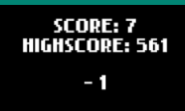
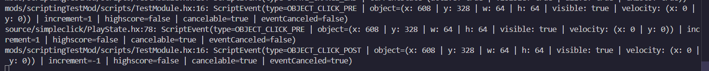

# SimpleClick Modding Docs : Known Issues

## Script Values go with Scripts but not to the actual game

I don't know how or why but when changing an events value with a script it doesn't get sent to the game.

